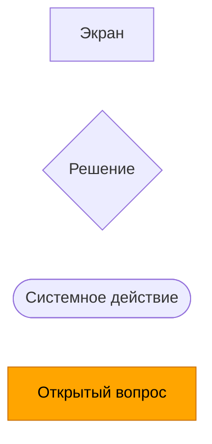
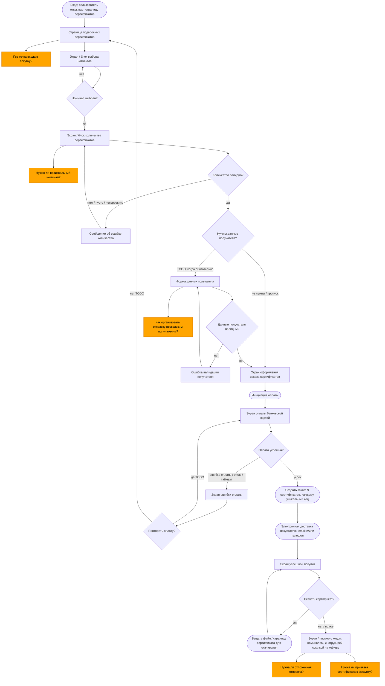
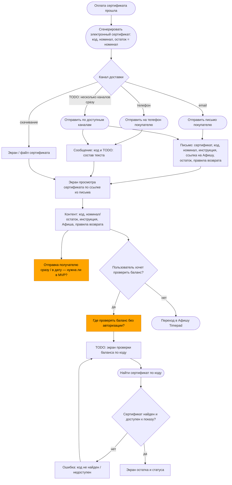
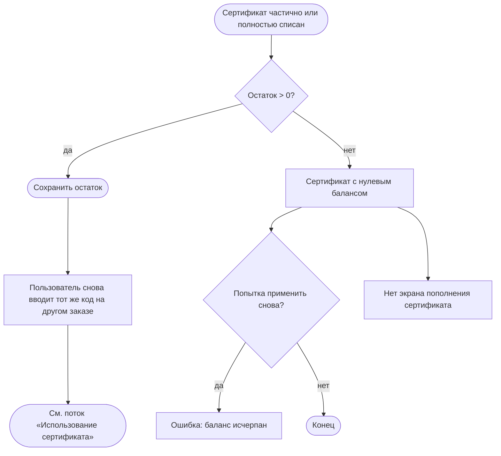
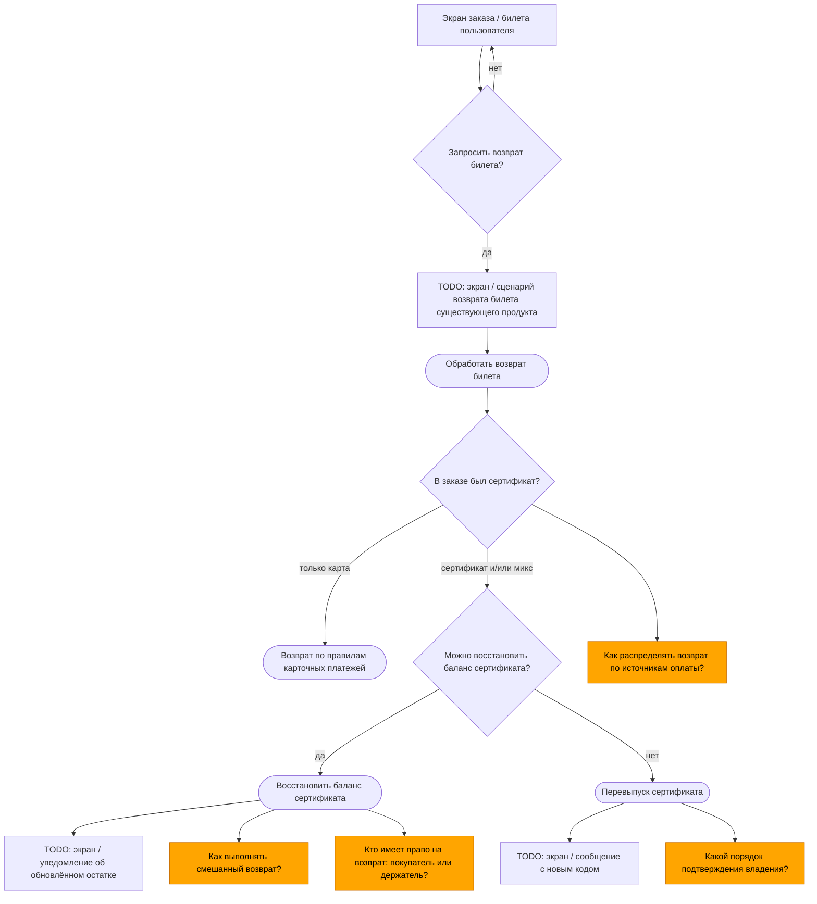
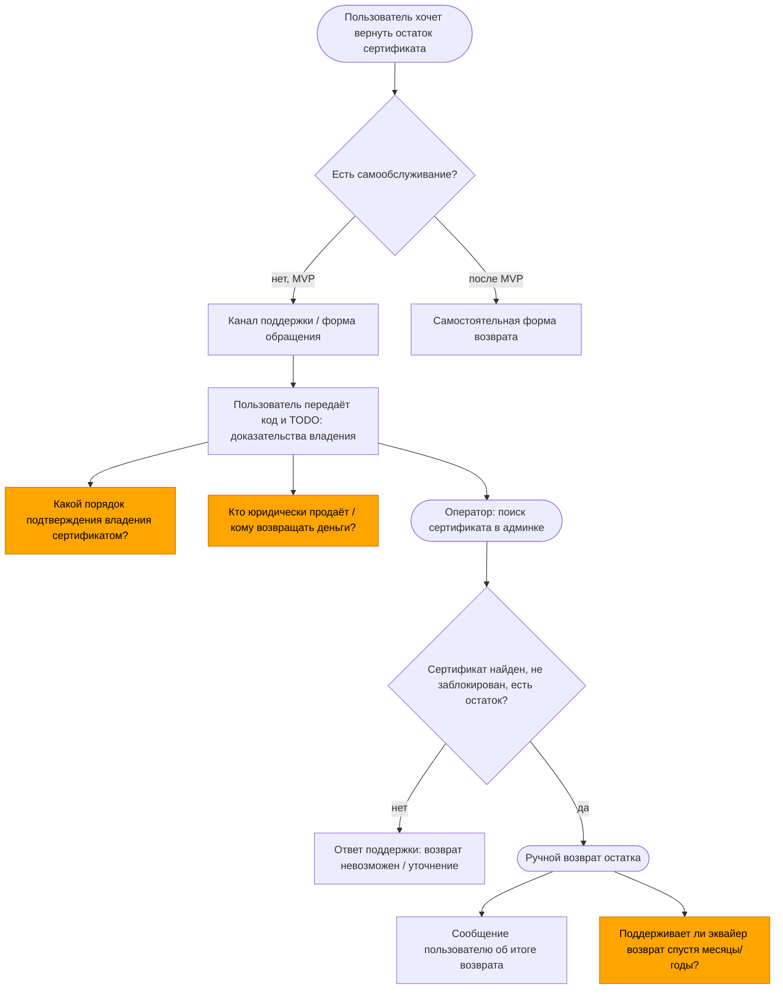
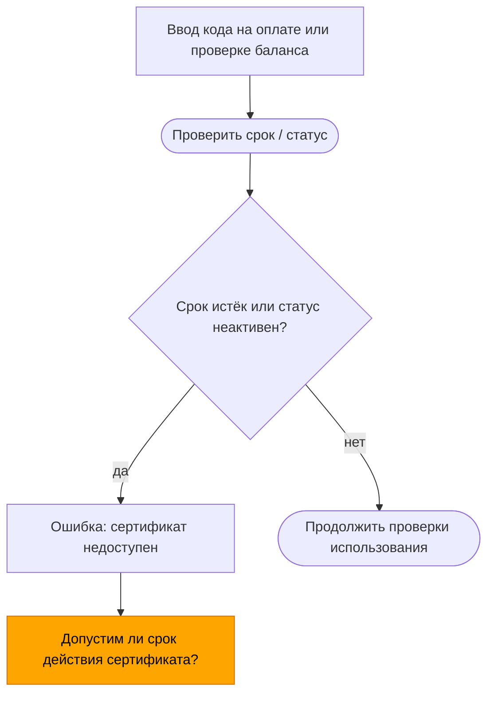

# User Screen Flow: подарочные сертификаты

Источник: PRD в `gift-certificates/` (`00`–`06`).  
`04-decisions.md` пуст: зафиксированных продуктовых решений нет. При конфликте приоритет из `00-project.md`: decisions → requirements (`02-roadmap.md`) → user flows (`03`) → open questions → roadmap.

## Условные обозначения

| Форма | Смысл | Mermaid |
| --- | --- | --- |
| Прямоугольник | Экран | `[Экран]` |
| Ромб | Решение пользователя или системы | `{Условие?}` |
| Скругленный прямоугольник | Системное действие | `([Действие])` |
| Оранжевая заметка | Открытый вопрос | узел `:::oq` + комментарий `%%` |
| `TODO` | Предположение, не подтверждённое PRD | текст в узле или рядом |

Скоуп диаграмм: пользовательские экраны покупателя, получателя и того, кто оплачивает билет сертификатом. Админка (поиск, блокировка, история) в MVP есть, но отдельно не развёрнута: это не user-facing flow.

---

## 1. Покупка сертификата

Покрывает сценарий 1 из `03-user-flows.md` и MVP из `06-roadmap.md`: фиксированные номиналы, один или несколько сертификатов в заказе, электронная доставка покупателю, уникальный код на каждый сертификат.

### Ошибки и альтернативы покупки

| Ветка | Что видит пользователь | Основание |
| --- | --- | --- |
| Не выбран номинал | Остаётся на выборе номинала | `03` |
| Некорректное количество | Ошибка на блоке количества | `03`, MVP: несколько сертификатов |
| Ошибка валидации получателя | Ошибка формы | `03`: данные получателя «при необходимости» |
| Ошибка оплаты | Экран ошибки, TODO: повтор | не детализировано |
| Успех | Коды + инструкция + Афиша | `03` |
| Скачивание | Альтернатива email/телефону | `03`: «или скачивает» |

`TODO`: нужна ли авторизация для покупки.  
`TODO`: обязательны ли одновременно email и телефон.  
`TODO`: формат скачиваемого сертификата.  
`TODO`: лимиты количества в одном заказе.

---

## 2. Получение сертификата

Сценарий 2 из `03`. MVP фиксирует доставку покупателю. Отправка получателю сразу или в дату — в user flows и open questions / после MVP; не считаем решением.

---

## 3. Использование сертификата при оплате билета

Сценарий 3–4 из `03`, правила из `02-roadmap.md` (requirements), ограничения MVP из `06`.

```mermaid
flowchart TD
  event([Пользователь оформляет билет на событие]) --> eventType{Событие с оплатой через Timepad?}

  eventType -->|бесплатное| noCertFree[Оплата без сертификата / поле не применимо]
  %% TODO: скрывать поле ввода кода или показывать ошибку при вводе — не описано.
  noCertFree --> oq_free[Как UX для бесплатных событий?]:::oq

  eventType -->|платное| cart[Экран корзины / оплаты билета]
  cart --> wantCert{Ввести код сертификата?}
  wantCert -->|нет| cardOnly[Оплата банковской картой]
  wantCert -->|да| codeInput[Поле ввода кода сертификата]

  codeInput --> validate([Проверки: существует, активен, не заблокирован, баланс, подходит для заказа])

  validate --> exists{Существует?}
  exists -->|нет| errExists[Ошибка: сертификат не найден]
  errExists --> codeInput

  exists -->|да| active{Активен?}
  active -->|нет| errActive[Ошибка: сертификат неактивен]
  %% TODO: причины неактивности для текста ошибки — срок, возврат, иное — не зафиксированы.
  errActive --> codeInput

  active -->|да| blocked{Заблокирован?}
  blocked -->|да| errBlock[Ошибка: сертификат заблокирован]
  errBlock --> codeInput

  blocked -->|нет| balance{Доступный баланс > 0?}
  balance -->|нет| errZero[Ошибка: баланс исчерпан]
  errZero --> codeInput

  balance -->|да| suitable{Подходит для оплаты этого заказа?}
  %% Правила из requirements: не на бесплатные; не на покупку других сертификатов; события с оплатой через Timepad.
  suitable -->|нет: покупка сертификатов| errBuyCert[Ошибка: нельзя оплатить сертификатом другой сертификат]
  errBuyCert --> codeInput
  suitable -->|нет: иное TODO| errSuit[Ошибка: сертификат не подходит для заказа]
  errSuit --> codeInput

  suitable -->|да| already{В заказе уже применён сертификат?}
  %% MVP: один сертификат в одном заказе.
  already -->|да| errMulti[Ошибка: в заказе уже есть сертификат]
  errMulti --> codeInput
  %% Открытый вопрос / после MVP: несколько сертификатов в одном заказе.
  already --> oq_multi[Можно ли применять несколько сертификатов?]:::oq

  already -->|нет| promoQ{В заказе есть промокод / скидка?}
  promoQ -->|да| applyPromo([Сначала применить скидку или промокод])
  promoQ -->|нет| applyCert
  applyPromo --> applyCert([Применить сертификат к билетам и сервисному сбору])

  applyCert --> reserve
  %% Открытый вопрос: как резервировать баланс и предотвратить параллельное списание.
  reserve([TODO: резерв баланса на время оплаты?]) --> oq_reserve[Как резервировать баланс? Как предотвратить параллельное списание?]:::oq

  reserve --> compare{Баланс сертификата >= сумма к оплате после скидки?}

  compare -->|да, хватает| payFullCert([Списать сумму заказа с баланса сертификата])
  payFullCert --> ticketOk[Экран успешной покупки билета]
  payFullCert --> balLeft([Сохранить остаток, если был])

  compare -->|нет, не хватает| splitPay[Экран частичной оплаты: сертификат + доплата картой]
  splitPay --> cardPay([Оплата остатка банковской картой])
  cardPay --> cardRes{Доплата успешна?}
  cardRes -->|нет| splitFail[Ошибка доплаты]
  %% TODO: откат резерва / снятие применения сертификата при ошибке доплаты — не описано.
  splitFail --> splitRetry{Повторить доплату?}
  splitRetry -->|да TODO| cardPay
  splitRetry -->|нет TODO| cart
  cardRes -->|да| debit([Списать доступный баланс сертификата, остаток по карте])
  debit --> ticketOk
  debit --> balLeft

  balLeft --> done([Показать / обновить остаток сертификата])

  %% Открытый вопрос: частичная оплата на стороне эквайера.
  splitPay --> oq_acq[Как проводить частичную оплату: сертификат + карта?]:::oq

  classDef oq fill:#FFA500,stroke:#CC7000,color:#000
```

### Матрица проверок при вводе кода

Порядок и тексты ошибок в PRD не зафиксированы (`TODO`). Логические проверки из `03`:

1. Существует ли сертификат  
2. Активен ли он  
3. Не заблокирован ли  
4. Какой баланс доступен  
5. Подходит ли для оплаты заказа  

Дополнительно из requirements / MVP:

- не для бесплатных событий  
- не для покупки других сертификатов  
- промокод и сертификат можно вместе: сначала скидка/промокод, затем сертификат  
- один сертификат на заказ (MVP)  
- покрытие билетов и сервисного сбора  
- остаток сохраняется; пополнить сертификат нельзя  

---

## 4. После покупки билета: остаток и повторное использование

---

## 5. Возврат билета, оплаченного сертификатом

MVP: восстановление баланса при возврате билета; перевыпуск при невозможности восстановления; ручной возврат остатка через поддержку. Юридические и бухгалтерские детали — в `05-open-questions.md`, не в экранах.

---

## 6. Возврат остатка сертификата через поддержку

MVP: ручной возврат остатка через поддержку. Самостоятельной формы в MVP нет (после MVP).

---

## 7. Срок использования и недоступность

Requirements: у сертификата есть срок использования. Допустим ли срок юридически — open question.

---

## 8. Сводная карта экранов

| ID | Экран | Поток |
| --- | --- | --- |
| S1 | Страница подарочных сертификатов | Покупка |
| S2 | Выбор номинала | Покупка |
| S3 | Количество | Покупка |
| S4 | Данные получателя (опционально) | Покупка |
| S5 | Оформление заказа сертификатов | Покупка |
| S6 | Оплата картой | Покупка / доплата |
| S7 | Ошибка оплаты | Покупка / доплата |
| S8 | Успешная покупка сертификата | Покупка |
| S9 | Скачивание / просмотр сертификата | Получение |
| S10 | Письмо / сообщение с сертификатом | Получение |
| S11 | TODO: проверка баланса по коду | Получение / open question |
| S12 | Корзина / оплата билета | Использование |
| S13 | Поле кода + ошибки валидации | Использование |
| S14 | Частичная оплата сертификат + карта | Использование |
| S15 | Успешная покупка билета | Использование |
| S16 | TODO: возврат билета (существующий продукт) | Возврат билета |
| S17 | TODO: уведомление о восстановлении / перевыпуске | Возврат билета |
| S18 | Обращение в поддержку | Возврат остатка |

Экраны админки (поиск, блокировка, история операций) — MVP для операторов, не входят в эту карту.

---

## 9. TODO и открытые вопросы, влияющие на flow

Зафиксированы как оранжевые заметки на диаграммах. Краткий список без ответов:

Из `05-open-questions.md`: произвольный номинал; отложенная отправка; привязка к аккаунту; массовая отправка нескольким получателям; где проверять баланс без авторизации; несколько сертификатов в заказе; резерв баланса и параллельные списания; частичная оплата на эквайере; смешанный возврат; кто вправе требовать возврат; подтверждение владения; допустимость срока; распределение возврата по источникам оплаты.

Предположения вне PRD (нельзя считать логикой продукта):

- `TODO`: обязательность авторизации при покупке и при применении кода  
- `TODO`: точный состав и порядок экранов checkout сертификатов vs встраивание блоками  
- `TODO`: тексты ошибок и порядок показа проверок  
- `TODO`: откат применения сертификата при неуспешной доплате  
- `TODO`: UX поля кода на бесплатных событиях  
- `TODO`: канал и содержание SMS  
- `TODO`: кто получает перевыпущенный код  
- `TODO`: лимиты количества сертификатов в одном заказе  
- `TODO`: пересечение «неактивен» и «истёк срок»  

`04-decisions.md` нужно заполнить до перевода этих `TODO` в требования к UI.
