# User Screen Flow: подарочные сертификаты (MVP)

Схема в FigJam: https://www.figma.com/board/w071nBuQgmwXTj8X50H2MH

## Легенда

| Обозначение | Значение |
| --- | --- |
| Белый прямоугольник | Экран или видимое состояние |
| Голубой ромб | Решение, меняющее путь |
| Светло-фиолетовый | Системное действие |
| Зелёный | Успешный результат |
| Красный | Ошибка |
| Оранжевый | Открытый вопрос |
| Серый пунктирный | Вне MVP или намеренно опущено |

Действия пользователя — на стрелках. Поток слева направо: покупка → использование → возвраты.

## Схема

```mermaid
%%{init: {"flowchart": {"curve": "basis", "nodeSpacing": 35, "rankSpacing": 55}}}%%
flowchart LR

subgraph buy ["1. Покупка и получение"]
  direction LR
  Start(["Старт"]):::transition
  Landing["Экран: Подарочные сертификаты"]:::screen
  Config["Экран: Номинал и количество"]:::screen
  OrderForm["Экран: Покупатель и получатель"]:::screen
  PayBuy["Экран: Оплата картой"]:::screen
  PayOk{"Оплата прошла?"}:::decision
  PayFail["Ошибка: платеж отклонен"]:::error
  Activate(["Система: активирует коды"]):::system
  GotCert["Успешно: сертификат получен"]:::success
  CertPage["Экран: Код, остаток, инструкция"]:::screen

  Start --> Landing
  Landing -->|"Выбирает номинал"| Config
  Config -->|"Оформляет"| OrderForm
  OrderForm -->|"Оплачивает"| PayBuy
  PayBuy --> PayOk
  PayOk -->|"Нет"| PayFail
  PayFail -->|"Повторяет"| PayBuy
  PayOk -->|"Да"| Activate
  Activate --> GotCert
  GotCert --> CertPage
end

subgraph use ["2. Использование на событии"]
  direction LR
  Poster["Экран: Афиша"]:::screen
  Event["Экран: Событие и билеты"]:::screen
  IsPaid{"Событие платное?"}:::decision
  FreeErr["Ошибка: на бесплатные нельзя"]:::error
  Checkout["Экран: Чекаут"]:::screen
  CodeField["Экран: Промокод или сертификат"]:::screen
  ApplyCode(["Система: применяет код"]):::system
  CodeOk{"Код применим?"}:::decision
  CodeErr["Ошибка: код недоступен"]:::error
  Enough{"Баланса хватает?"}:::decision
  ChargeFull(["Система: списывает сертификат"]):::system
  Topup["Экран: Доплата картой"]:::screen
  ChargeMixed(["Система: сертификат + карта"]):::system
  Bought["Успешно: билеты куплены"]:::success

  CertPage -->|"Выбрать событие"| Poster
  Poster -->|"Выбирает событие"| Event
  Event --> IsPaid
  IsPaid -->|"Нет"| FreeErr
  FreeErr -->|"Выбирает другое"| Poster
  IsPaid -->|"Да"| Checkout
  Checkout -->|"Вводит код"| CodeField
  CodeField --> ApplyCode
  ApplyCode --> CodeOk
  CodeOk -->|"Нет"| CodeErr
  CodeErr -->|"Исправляет или платит картой"| Checkout
  CodeOk -->|"Да"| Enough
  Enough -->|"Да"| ChargeFull
  ChargeFull --> Bought
  Enough -->|"Нет"| Topup
  Topup -->|"Доплачивает"| ChargeMixed
  ChargeMixed --> Bought
end

subgraph ticketRefund ["3. Возврат билета"]
  direction LR
  MyOrder["Экран: Мой заказ"]:::screen
  CanRefund{"Возврат доступен?"}:::decision
  NoRefund["Ошибка: возврат недоступен"]:::error
  Preview["Экран: Сколько на карту и на сертификат"]:::screen
  DoRefund(["Система: смешанный возврат"]):::system
  CertAlive{"Сертификат можно восстановить?"}:::decision
  Restore(["Система: возвращает на баланс"]):::system
  Reissue(["Система: выпускает новый код"]):::system
  RefundDone["Успешно: возврат выполнен"]:::success

  Bought -->|"Открывает заказ"| MyOrder
  MyOrder -->|"Запрашивает возврат"| CanRefund
  CanRefund -->|"Нет"| NoRefund
  NoRefund -->|"Пишет в поддержку"| Support
  CanRefund -->|"Да"| Preview
  Preview -->|"Подтверждает"| DoRefund
  DoRefund --> CertAlive
  CertAlive -->|"Да"| Restore
  Restore --> RefundDone
  CertAlive -->|"Нет"| Reissue
  Reissue --> RefundDone
end

subgraph certRefund ["4. Возврат остатка сертификата"]
  direction LR
  Support["Экран: Обращение в поддержку"]:::screen
  Verify(["Система: проверяет владение"]):::system
  OwnerOk{"Владение подтверждено?"}:::decision
  NeedDocs["Ошибка: нужны документы"]:::error
  ReturnMoney(["Система: блокирует и возвращает остаток"]):::system
  AutoOk{"Возврат на исходную оплату?"}:::decision
  MoneyBack["Успешно: остаток возвращен"]:::success
  Manual["Экран: Ручная обработка"]:::screen

  CertPage -->|"Хочет вернуть деньги"| Support
  Support -->|"Отправляет код и заявление"| Verify
  Verify --> OwnerOk
  OwnerOk -->|"Нет"| NeedDocs
  NeedDocs -->|"Досылает данные"| Support
  OwnerOk -->|"Да"| ReturnMoney
  ReturnMoney --> AutoOk
  AutoOk -->|"Да"| MoneyBack
  AutoOk -->|"Нет"| Manual
  Manual --> MoneyBack
end

Q1["Открытый вопрос: кто вправе требовать возврат"]:::question
Q2["Открытый вопрос: сгорает ли срок действия"]:::question
Q3["Открытый вопрос: порядок смешанного возврата"]:::question
D1["Не в схеме: лимит попыток, резерв, SMS, несколько сертификатов"]:::deferred

Support -.-> Q1
CertPage -.-> Q2
DoRefund -.-> Q3
CodeField -.-> D1

classDef screen fill:#FFFFFF,stroke:#A9A9B8,color:#111;
classDef system fill:#F1ECFA,stroke:#7B61A8,color:#241A35;
classDef decision fill:#E5EEFF,stroke:#608DDF,color:#142C57;
classDef success fill:#E3F6E5,stroke:#57A961,color:#173D1D;
classDef error fill:#FFE0E0,stroke:#DE4949,color:#8A1717;
classDef question fill:#FFF0BF,stroke:#D99500,color:#5C3B00;
classDef deferred fill:#F3F3F3,stroke:#999999,color:#666666;
classDef transition fill:#FFFFFF,stroke:#777777,color:#444444;

style buy fill:#FAFAFC,stroke:#C8C8D0
style use fill:#F7FAFF,stroke:#A8B8D8
style ticketRefund fill:#FFF8F2,stroke:#D8B8A0
style certRefund fill:#F8F7FC,stroke:#B8A8C8
```

## Что убрано из схемы намеренно

Чтобы не раздувать user screen flow:

- резерв выпуска до оплаты (внутренняя механика, не экран пользователя);
- отдельный шаг «применить промокод», затем «применить сертификат» — одно поле «промокод или сертификат»;
- детальный retry доплаты со снятием блокировки баланса;
- лимит попыток ввода кода и антифрод-петли;
- повторная отправка письма и скачивание файла как отдельные ветки;
- массовая покупка, отложенная отправка, физические карты, свой дизайн;
- несколько сертификатов в одном заказе;
- админские процессы, не продолжающие путь пользователя.

## Покрытые сценарии

1. Покупка: страница → номинал → данные → оплата → активация → экран сертификата.
2. Использование: афиша → событие → чекаут → единое поле кода → списание или доплата картой.
3. Ошибки: отказ оплаты, бесплатное событие, неприменимый код; у каждой есть следующий шаг.
4. Возврат билета: правила события → превью распределения → восстановление баланса или новый код.
5. Возврат остатка сертификата: поддержка → владение → автовозврат или ручная обработка.

## Открытые вопросы

1. Кто вправе требовать возврат остатка: покупатель или предъявитель.
2. Срок действия: заявлен год, при этом остаток не должен сгорать.
3. Порядок смешанного возврата: пропорционально или «сначала сертификат, затем карта».
4. Подтверждение владения и возврат на исходную оплату спустя длительный срок.
