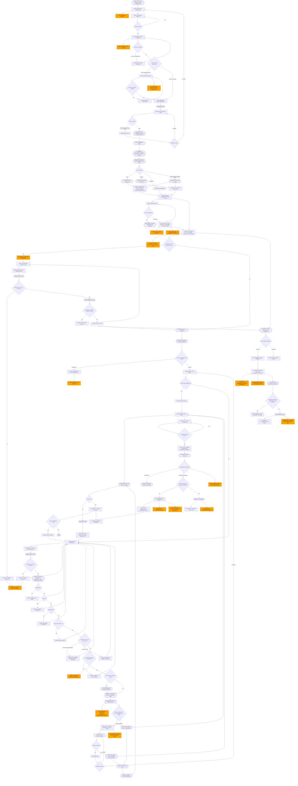

```mermaid
flowchart TD
  start([Вход: пользователь открывает страницу сертификатов]) --> landing[Страница подарочных сертификатов]

  %% Открытый вопрос: где живёт страница — Афиша, timepad.ru, отдельный URL?
  landing --> oq_where[Где точка входа в покупку?]:::oq

  landing --> chooseNom[Экран / блок выбора номинала]
  chooseNom --> nomOk{Номинал выбран?}
  nomOk -->|нет| chooseNom
  nomOk -->|да| qty[Экран / блок количества сертификатов]

  %% Открытый вопрос: нужен ли произвольный номинал? В MVP — только фиксированные.
  qty --> oq_custom[Нужен ли произвольный номинал?]:::oq

  qty --> qtyOk{Количество валидно?}
  qtyOk -->|нет / пусто / некорректно| qtyErr[Сообщение об ошибке количества]
  qtyErr --> qty
  qtyOk -->|да| recipientQ{Нужны данные получателя?}

  %% TODO: PRD говорит «при необходимости» — критерий необходимости не зафиксирован.
  recipientQ -->|TODO: когда обязательно| recipient[Форма данных получателя]
  recipientQ -->|не нужны / пропуск| checkoutPrep
  recipient --> recipientOk{Данные получателя валидны?}
  recipientOk -->|нет| recipientErr[Ошибка валидации получателя]
  recipientErr --> recipient
  recipientOk -->|да| checkoutPrep

  %% Открытый вопрос: массовая покупка и отправка нескольким получателям.
  recipient --> oq_mass[Как организовать отправку нескольким получателям?]:::oq

  checkoutPrep[Экран оформления заказа сертификатов] --> payStart([Инициация оплаты])
  payStart --> payUi[Экран оплаты банковской картой]
  payUi --> payResult{Оплата успешна?}

  payResult -->|ошибка оплаты / отказ / таймаут| payFail[Экран ошибки оплаты]
  payFail --> retry{Повторить оплату?}
  %% TODO: поведение повтора и отмены заказа не описано в PRD.
  retry -->|да TODO| payUi
  retry -->|нет TODO| landing

  payResult -->|успех| issue([Создать заказ: N сертификатов, каждому уникальный код])
  issue --> paid([Оплата сертификата прошла])
  paid --> gen([Сгенерировать электронный сертификат: код, номинал, остаток = номинал])
  gen --> deliverBuyer([Электронная доставка покупателю: email и/или телефон])
  deliverBuyer --> channel{Канал доставки}

  channel -->|email| emailSend([Отправить письмо покупателю])
  channel -->|телефон| smsSend([Отправить на телефон покупателю])
  channel -->|скачивание| dl[Экран / файл сертификата]
  channel -->|TODO: несколько каналов сразу| multi([Отправить по доступным каналам])

  emailSend --> inbox[Письмо: сертификат, код, номинал, инструкция, ссылка на Афишу, остаток, правила возврата]
  smsSend --> phoneMsg[Сообщение: код и TODO: состав текста]
  multi --> inbox
  multi --> phoneMsg

  inbox --> openCert[Экран просмотра сертификата по ссылке из письма]
  phoneMsg --> openCert
  dl --> openCert

  openCert --> success[Экран успешной покупки]
  success --> downloadOpt{Скачать сертификат?}
  downloadOpt -->|да| download([Выдать файл / страницу сертификата для скачивания])
  download --> success
  downloadOpt -->|нет / позже| postBuy[Экран / письмо с кодом, номиналом, инструкцией, ссылкой на Афишу]

  %% Открытый вопрос: отложенная отправка и персональное поздравление — после MVP.
  postBuy --> oq_delay[Нужна ли отложенная отправка?]:::oq
  postBuy --> oq_bind[Нужна ли привязка сертификата к аккаунту?]:::oq

  postBuy --> content[Контент: код, номинал/остаток, инструкция, Афиша, правила возврата]
  openCert --> content

  %% Открытый вопрос: отправка получателю сразу или в выбранную дату — не MVP.
  content --> oq_to[Отправка получателю сразу / в дату — нужна ли в MVP?]:::oq

  %% Открытый вопрос: где проверять баланс без авторизации.
  content --> checkBal{Пользователь хочет проверить баланс?}
  checkBal -->|да| oq_bal[Где проверять баланс без авторизации?]:::oq
  checkBal -->|нет| afisha([Переход в Афишу Timepad])

  oq_bal --> balScreen[TODO: экран проверки баланса по коду]
  balScreen --> balCode[Ввод кода на оплате или проверке баланса]
  balCode --> life([Проверить срок / статус])
  life --> expired{Срок истёк или статус неактивен?}
  expired -->|да| errExp[Ошибка: сертификат недоступен]
  %% TODO: единый ли это статус с «неактивен» из сценария 3 — не зафиксировано.
  errExp --> oq_term[Допустим ли срок действия сертификата?]:::oq
  expired -->|нет| balLookup([Найти сертификат по коду])
  balLookup --> balFound{Сертификат найден и доступен к показу?}
  balFound -->|нет| balErr[Ошибка: код не найден / недоступен]
  balErr --> balScreen
  balFound -->|да| balView[Экран остатка и статуса]
  %% TODO: какие поля статуса показывать без авторизации — не решено.

  balView --> userNeed
  content --> userNeed
  balView --> afisha
  afisha --> event

  event([Пользователь оформляет билет на событие]) --> eventType{Событие с оплатой через Timepad?}

  eventType -->|бесплатное| noCertFree[Оплата без сертификата / поле не применимо]
  %% TODO: скрывать поле ввода кода или показывать ошибку при вводе — не описано.
  noCertFree --> oq_free[Как UX для бесплатных событий?]:::oq

  eventType -->|платное| cart[Экран корзины / оплаты билета]
  cart --> wantCert{Ввести код сертификата?}
  wantCert -->|нет| cardOnly[Оплата банковской картой]
  wantCert -->|да| codeInput[Поле ввода кода сертификата]

  codeInput --> codeLife[Ввод кода на оплате или проверке баланса]
  codeLife --> lifeUse([Проверить срок / статус])
  lifeUse --> expiredUse{Срок истёк или статус неактивен?}
  expiredUse -->|да| errExpUse[Ошибка: сертификат недоступен]
  errExpUse --> oq_term
  errExpUse --> codeInput
  expiredUse -->|нет| validate([Проверки: существует, активен, не заблокирован, баланс, подходит для заказа])

  validate --> exists{Существует?}
  exists -->|нет| errExists[Ошибка: сертификат не найден]
  errExists --> codeInput

  exists -->|да| active{Активен?}
  active -->|нет| errActive[Ошибка: сертификат неактивен]
  %% TODO: причины неактивности для текста ошибки — срок, возврат, иное — не зафиксированы.
  errActive --> codeInput

  active -->|да| blocked{Заблокирован?}
  blocked -->|да| errBlock[Ошибка: сертификат заблокирован]
  errBlock --> codeInput

  blocked -->|нет| balance{Доступный баланс > 0?}
  balance -->|нет| errZero[Ошибка: баланс исчерпан]
  errZero --> codeInput

  balance -->|да| suitable{Подходит для оплаты этого заказа?}
  %% Правила из requirements: не на бесплатные; не на покупку других сертификатов; события с оплатой через Timepad.
  suitable -->|нет: покупка сертификатов| errBuyCert[Ошибка: нельзя оплатить сертификатом другой сертификат]
  errBuyCert --> codeInput
  suitable -->|нет: иное TODO| errSuit[Ошибка: сертификат не подходит для заказа]
  errSuit --> codeInput

  suitable -->|да| already{В заказе уже применён сертификат?}
  %% MVP: один сертификат в одном заказе.
  already -->|да| errMulti[Ошибка: в заказе уже есть сертификат]
  errMulti --> codeInput
  %% Открытый вопрос / после MVP: несколько сертификатов в одном заказе.
  already --> oq_multi[Можно ли применять несколько сертификатов?]:::oq

  already -->|нет| promoQ{В заказе есть промокод / скидка?}
  promoQ -->|да| applyPromo([Сначала применить скидку или промокод])
  promoQ -->|нет| applyCert
  applyPromo --> applyCert([Применить сертификат к билетам и сервисному сбору])

  applyCert --> reserve
  %% Открытый вопрос: как резервировать баланс и предотвратить параллельное списание.
  reserve([TODO: резерв баланса на время оплаты?]) --> oq_reserve[Как резервировать баланс? Как предотвратить параллельное списание?]:::oq

  reserve --> compare{Баланс сертификата >= сумма к оплате после скидки?}

  compare -->|да, хватает| payFullCert([Списать сумму заказа с баланса сертификата])
  payFullCert --> ticketOk[Экран успешной покупки билета]
  payFullCert --> balLeft([Сохранить остаток, если был])

  compare -->|нет, не хватает| splitPay[Экран частичной оплаты: сертификат + доплата картой]
  splitPay --> cardPay([Оплата остатка банковской картой])
  cardPay --> cardRes{Доплата успешна?}
  cardRes -->|нет| splitFail[Ошибка доплаты]
  %% TODO: откат резерва / снятие применения сертификата при ошибке доплаты — не описано.
  splitFail --> splitRetry{Повторить доплату?}
  splitRetry -->|да TODO| cardPay
  splitRetry -->|нет TODO| cart
  cardRes -->|да| debit([Списать доступный баланс сертификата, остаток по карте])
  debit --> ticketOk
  debit --> balLeft

  balLeft --> showBal([Показать / обновить остаток сертификата])

  %% Открытый вопрос: частичная оплата на стороне эквайера.
  splitPay --> oq_acq[Как проводить частичную оплату: сертификат + карта?]:::oq

  cardOnly --> ticketOk
  showBal --> used
  ticketOk --> used
  ticketOk --> ticket

  used([Сертификат частично или полностью списан]) --> check{Остаток > 0?}
  check -->|да| keep([Сохранить остаток])
  keep --> reuse[Пользователь снова вводит тот же код на другом заказе]
  reuse --> codeInput
  check -->|нет| empty[Сертификат с нулевым балансом]
  empty --> emptyTry{Попытка применить снова?}
  emptyTry -->|да| errZeroReuse[Ошибка: баланс исчерпан]
  errZeroReuse --> codeInput
  emptyTry -->|нет| stop([Конец])

  %% Сертификат нельзя пополнить — requirements.
  empty --> noTopup[Нет экрана пополнения сертификата]

  ticket[Экран заказа / билета пользователя] --> wantRefund{Запросить возврат билета?}
  wantRefund -->|нет| ticket
  wantRefund -->|да| refundUi[TODO: экран / сценарий возврата билета существующего продукта]

  refundUi --> refundSys([Обработать возврат билета])
  refundSys --> paidHow{В заказе был сертификат?}

  paidHow -->|только карта| cardRefund([Возврат по правилам карточных платежей])
  paidHow -->|сертификат и/или микс| restoreQ{Можно восстановить баланс сертификата?}

  restoreQ -->|да| restore([Восстановить баланс сертификата])
  restore --> restored[TODO: экран / уведомление об обновлённом остатке]
  restored --> keep

  restoreQ -->|нет| reissue([Перевыпуск сертификата])
  reissue --> reissueNotify[TODO: экран / сообщение с новым кодом]
  %% TODO: кто получает новый код — покупатель билета, исходный покупатель сертификата, держатель — не решено.

  restore --> oq_mix[Как выполнять смешанный возврат?]:::oq
  restore --> oq_who[Кто имеет право на возврат: покупатель или держатель?]:::oq
  reissue --> oq_own[Какой порядок подтверждения владения?]:::oq

  %% Открытый вопрос: распределение возврата пропорционально или по приоритету.
  paidHow --> oq_alloc[Как распределять возврат по источникам оплаты?]:::oq

  userNeed([Пользователь хочет вернуть остаток сертификата]) --> self{Есть самообслуживание?}
  self -->|нет, MVP| supportEntry[Канал поддержки / форма обращения]
  self -->|после MVP| selfForm[Самостоятельная форма возврата]

  supportEntry --> ask[Пользователь передаёт код и TODO: доказательства владения]
  ask --> oq_proof[Какой порядок подтверждения владения сертификатом?]:::oq
  ask --> oq_party[Кто юридически продаёт / кому возвращать деньги?]:::oq

  ask --> agent([Оператор: поиск сертификата в админке])
  agent --> status{Сертификат найден, не заблокирован, есть остаток?}
  status -->|нет| supportNo[Ответ поддержки: возврат невозможен / уточнение]
  status -->|да| manual([Ручной возврат остатка])
  manual --> supportDone[Сообщение пользователю об итоге возврата]

  %% Открытый вопрос: чеки, эквайер, давние сертификаты — вне UI, влияют на исход.
  manual --> oq_acq2[Поддерживает ли эквайер возврат спустя месяцы/годы?]:::oq

  classDef oq fill:#FFA500,stroke:#CC7000,color:#000
```
