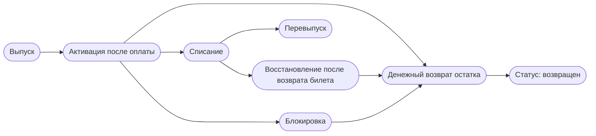
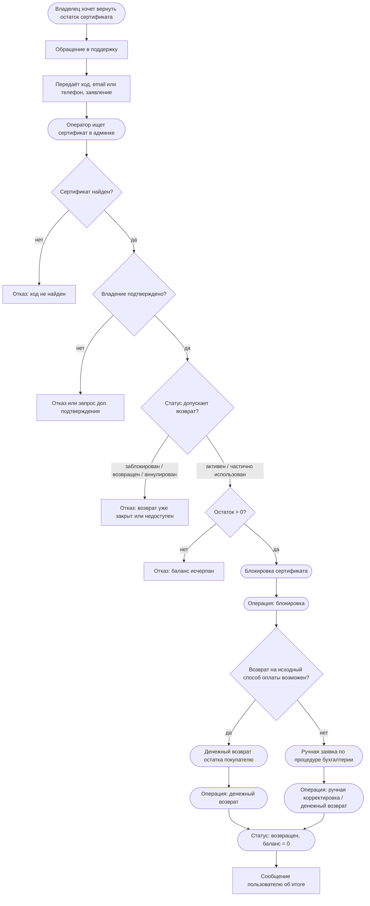
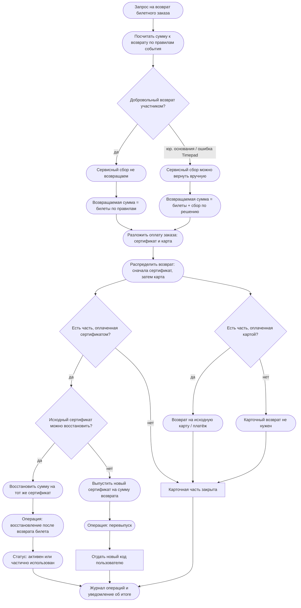
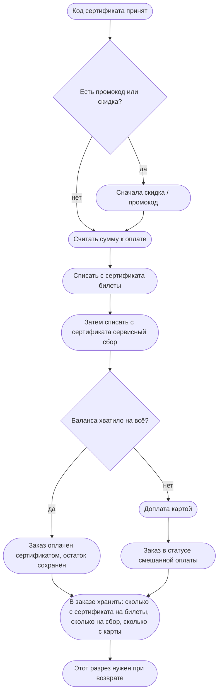

# Флоу возврата подарочного сертификата

Источник: PRD в `00-project.md`, `02-roadmap.md`, `03-user-flows.md`, `05-open-questions.md`, `06-roadmap.md`.
В репозитории нет описания текущих событийных сертификатов Timepad. Ниже опираемся только на продуктовый PRD универсального сертификата.

Есть два разных возврата. Их нельзя смешивать в одной схеме.

Первый: возврат неиспользованного остатка самого сертификата. Это ручной сценарий через поддержку в MVP.

Второй: возврат билетного заказа, который был оплачен сертификатом полностью или частично. Деньги и баланс расходятся по источникам оплаты.

Сильнейший контраргумент к базовому решению «возвращать только покупателю на исходный способ оплаты»: держатель сертификата может оказаться тем, кто по закону вправе требовать возврат предоплаты, а покупатель уже подарил ценность. Если закрепить возврат только покупателю без понятного подтверждения владения, поддержка получит спорные кейсы и ручные эскалации.

## Операции баланса, на которых держится возврат

Баланс меняется только через операции. Для возвратов нужны как минимум: списание при оплате билета, восстановление после возврата билета, денежный возврат остатка сертификата, блокировка, перевыпуск, ручная корректировка.

Каждая операция хранит сумму, дату, тип, связанный заказ или возврат, баланс до и после, инициатора.

## 1. Возврат остатка самого сертификата

MVP-путь: пользователь пишет в поддержку, поддержка проверяет, блокирует сертификат и возвращает остаток на исходный способ оплаты покупателя. Автовозврат на произвольную карту в MVP не делаем.

Открытые развилки, которые ещё нужно закрыть с Сережей Т и юристами: кто именно вправе инициировать возврат, покупатель или предъявитель; какой минимум доказательств владения достаточен; что делать, если эквайер уже не принимает возврат по старому платежу.

## 2. Возврат билетного заказа, оплаченного сертификатом

Сумма к возврату считается по правилам события. Способ оплаты не меняет размер положенного возврата. Меняется только маршрут денег.

Сначала считаем возвращаемую сумму билетов. Сервисный сбор при добровольном возврате участником по умолчанию не возвращаем. Если позже есть юр. основания или ошибка Timepad, сбор можно вернуть вручную через поддержку.

Для MVP предлагаем распределение «в обратном порядке списания»: сначала восстанавливаем на сертификат то, что с него списали в пределах возвращаемой суммы, затем остаток возвращаем на карту. Это проще сверки и журнала операций. Пропорциональное распределение честнее на вид, но дороже в реализации и спорнее при частичных возвратах нескольких билетов.

Пример из PRD. Заказ: билеты 4 000, сбор 400. Сертификатом оплачено 3 000, картой 1 400. При добровольном возврате билетов без возврата сбора возвращаем 4 000: 3 000 на сертификат и 1 000 на карту. 400 сбора остаются у Timepad.

## 3. Частичная оплата и как она связана с возвратом

На чекауте списываем сначала стоимость билетов, затем сервисный сбор. Если баланса не хватает, остаток идёт картой. В заказе для MVP применяется один сертификат.

Без разреза «билеты / сбор / источник оплаты» возврат начнёт расходиться с бухгалтерией уже на первых смешанных кейсах.

## 4. Что считаем решением для MVP

Возврат остатка сертификата только через поддержку. Деньги уходят покупателю на исходный способ оплаты. Если исходный возврат технически невозможен, заявка уходит в ручную бухгалтерскую процедуру.

При возврате билета сертификатная часть возвращается на баланс того же сертификата. Если восстановить нельзя, выпускаем новый сертификат на сумму возврата. Карточная часть возвращается на карту. Сервисный сбор при добровольном возврате не возвращаем автоматически, но админка должна уметь вернуть его вручную.

Все движения баланса пишутся операциями. Прямое изменение баланса без операции запрещено.

## 5. Что ещё не решено

Кто юридически продаёт сертификат и кому можно возвращать деньги. Допустим ли срок действия без «сгорания» права на возврат предоплаты. Как эквайер ведёт себя на возвратах через месяцы и годы. Нужен ли отдельный платёжный или бонусный счёт. Эти вопросы остаются в `05-open-questions.md` и блокируют финальную финансовую модель.
